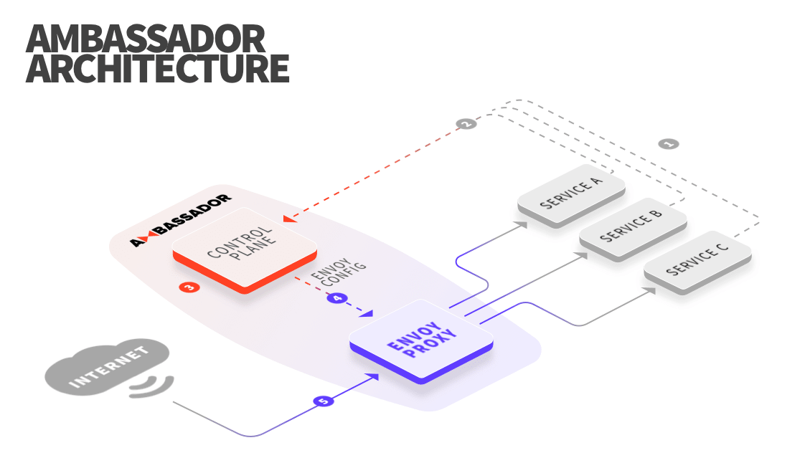

# The Emissary Ingress architecture

## Emissary Ingress is a control plane

Emissary Ingress is a specialized [control plane for Envoy Proxy](https://blog.getambassador.io/the-importance-of-control-planes-with-service-meshes-and-front-proxies-665f90c80b3d). In this architecture, Emissary Ingress translates configuration (in the form of Kubernetes Custom Resources) to Envoy configuration. All actual traffic is directly handled by the high-performance [Envoy Proxy](https://www.envoyproxy.io).

## Details

1. The service owner defines configuration in Kubernetes manifests.
2. When the manifest is applied to the cluster, the Kubernetes API notifies Emissary Ingress of the change.
3. Emissary Ingress parses the change and transforms the configuration into a semantic intermediate representation. Envoy configuration is generated from this IR.
4. The new configuration is passed to Envoy via the gRPC-based Aggregated Discovery Service (ADS) API.
5. Traffic flows through the reconfigured Envoy, without dropping any connections.

## Scaling and availability

Emissary Ingress relies on Kubernetes for scaling, high availability, and persistence. All Emissary Ingress configuration is stored directly in Kubernetes; there is no database. $productName$ is packaged as a single container that contains both the control plane and an Envoy Proxy instance. By default, $productName$ is deployed as a Kubernetes `deployment` and can be scaled and managed like any other Kubernetes deployment.

### Stateless architecture

By design, Emissary Ingress is an entirely stateless architecture. Each individual Emissary Ingress instance operates independently of other instances. These $productName$ instances rely on Kubernetes to coordinate the configuration between the different $productName$ instances. This enables $productName$ to sidestep the need to engineer a safe, highly available centralized control plane (and if you don't think that this is hard, check out [Jepsen](https://jepsen.io)). By contrast, other control plane architectures rely on a single centralized control plane to manage multiple instances of the data plane. This means that these control plane architectures must engineer resilience and availability into their central control plane.

## Envoy Proxy

Emissary Ingress closely tracks Envoy Proxy releases. A stable branch of Envoy Proxy is maintained that enables the team to cherry-pick specific fixes into Emissary Ingress.
