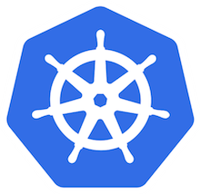
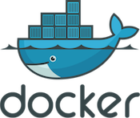

# Installing Emissary

##  Install with Helm

Helm, the package manager for Kubernetes, is the recommended way to install
Emissary. Full details are in the [Helm instructions.](helm/)

##  Install with Kubernetes YAML

Another way to install Emissary if you are unable to use Helm is to
directly apply Kubernetes YAML. See details in the
[manual YAML installation instructions.](yaml-install).

##  Try the demo with Docker

The Docker install will let you try the Emissary locally in seconds,
but is not supported for production workloads. [Try Emissary on Docker.](docker/)

## Upgrade or migrate to a newer version

If you already have an existing installation of Ambassador Edge Stack or
Emissary, you can upgrade your instance. The [migration matrix](migration-matrix/)
shows you how.

## Container Images

Although our installation guides will favor using the `docker.io` container registry,
we publish Ambassador Edge Stack and Emissary releases to multiple registries.

Starting with version 1.0.0, you can pull the emissary image from any of the following registries:

- `docker.io/emissaryingress/`
- `gcr.io/datawire/`

We want to give you flexibility and independence from a hosting platform's uptime to support
your production needs for Ambassador Edge Stack or Emissary. Read more about
[Running Emissary in Production](../running).

# What’s Next?

Emissary has a comprehensive range of [features](/features/) to
support the requirements of any edge microservice. To learn more about how Emissary works, along with use cases, best practices, and more,
check out the [Welcome page](../../tutorials/getting-started) or read the [Emissary
Story](../../about/why-ambassador).
